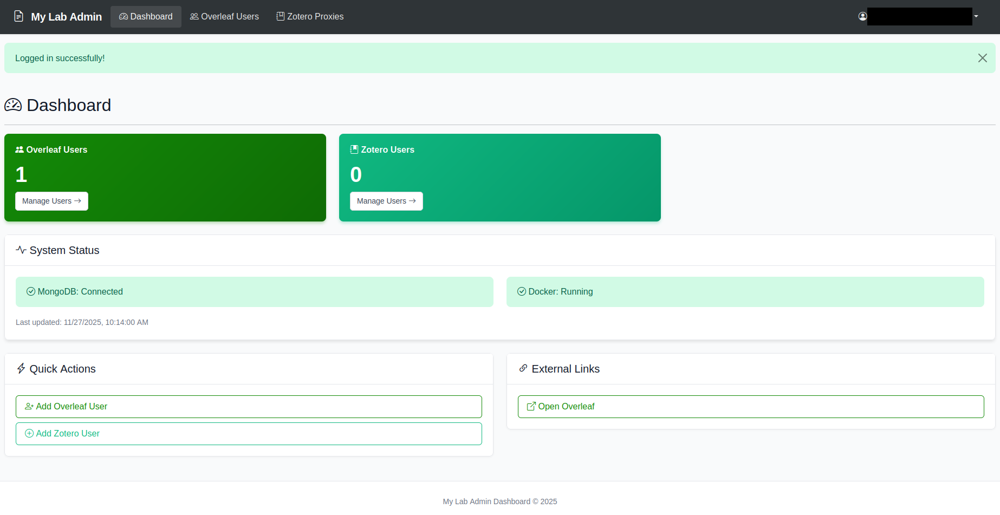
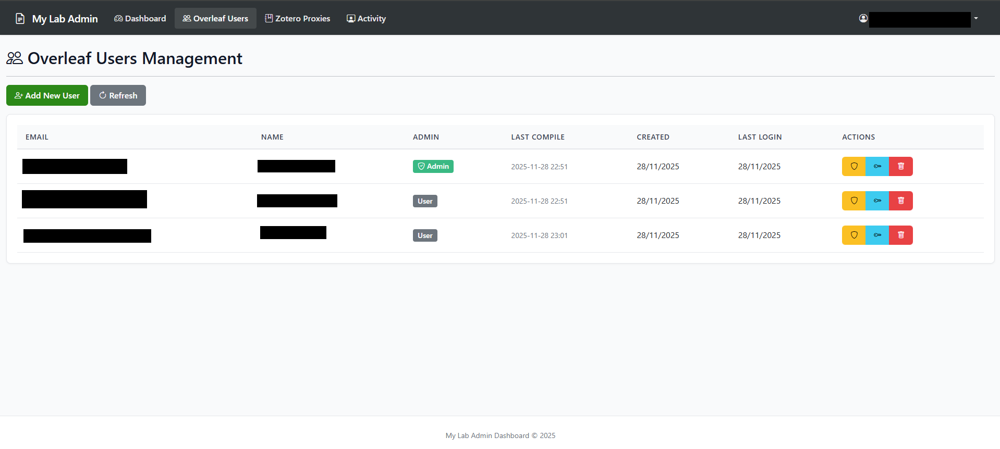
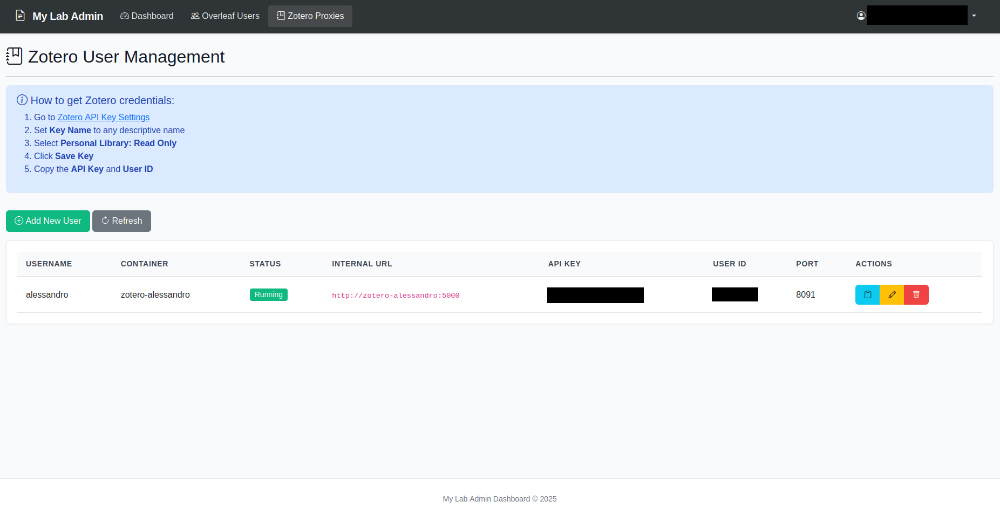
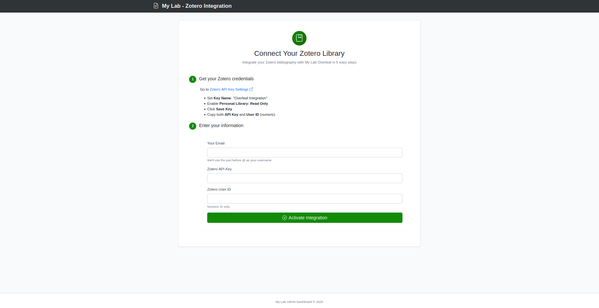
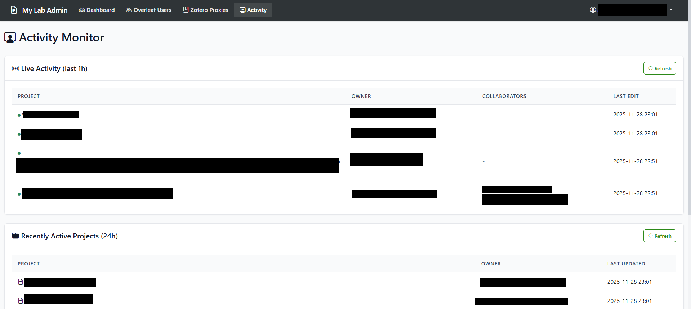

# Overleaf Lab

Zero-stress, single-command setup for a full-featured self-hosted Overleaf with Zotero integration and a web dashboard for user management. Run `./install.sh` and answer a few questions, you'll have a complete LaTeX environment ready for your research lab or team. Public access via Cloudflare Tunnel is also guided.

Scripts have been tested on Ubuntu 24.

## Features

**Overleaf Extended CE** (via [overleaf-cep](https://github.com/yu-i-i/overleaf-cep)):

- Sandboxed Compiles (each project compiles in an isolated container)
- Track Changes
- Comments and review system
- Template gallery
- Project history with restore functionality

**Full TeXLive + Microsoft Fonts**:

- Complete TeXLive distribution (all packages included)
- Microsoft core fonts (Arial, Times New Roman, Courier, etc.)
- No "missing package" or "font not found" errors

**Custom Zotero Integration**:

- Access full library or specific collections by name
- `.bib` files importable directly into Overleaf projects (refresh to sync)

**Admin Dashboard**:

- Manage Overleaf users (create, delete, reset passwords, assign/remove admin rights)
- Configure Zotero integrations per user
- Optional signup page for Zotero self-registration

## Screenshots

<p align="center">
  
  
</p>

<p align="center">
  
  
</p>

<p align="center">
  
</p>

## Architecture

| Service       | Port | Description                      |
| ------------- | ---- | -------------------------------- |
| **Overleaf**  | 80   | LaTeX editor                     |
| **Dashboard** | 5000 | Admin panel for users and Zotero |

See [CONFIGURATION.md](CONFIGURATION.md) for all settings and customization options.

## SMTP (Recommended)

Email is required for password resets and notifications. For Gmail:

1. Enable 2FA on your Google account
2. Create an App Password: https://myaccount.google.com/apppasswords
3. Use during installation:
   - SMTP Host: `smtp.gmail.com`
   - SMTP Port: `587`
   - SMTP User: `your-email@gmail.com`
   - SMTP Password: `your-app-password`

## Installation

```bash
git clone https://github.com/alelotti96/overleaf-lab.git
cd overleaf-lab
chmod +x *.sh scripts/*.sh
./install.sh
```

The script asks for:

- Lab name and admin email
- Dashboard admin password
- SMTP settings (optional)
- Public Zotero signup (yes/no)

## After Installation

1. **Create Overleaf admin**: http://localhost/launchpad
2. **Access Dashboard**: http://localhost:5000 (use admin email + password set during install)

### Dashboard Functions

- **Users**: View, create, delete Overleaf users, reset passwords, assign/remove admin rights
- **Zotero**: Add/remove Zotero users, configure API keys per user
- **Activity**: Live project activity tracking with owner and collaborators
- **Signup** (if enabled): Page where users can self-register their Zotero credentials

## Zotero Integration

Each user gets a personal container serving their Zotero bibliography:

```
http://zotero-username:5000             → Full library
http://zotero-username:5000/collection  → Specific collection
```

In Overleaf: **New File → From External URL** → paste the URL as `references.bib`

> **Technical Note:** The installation automatically configures Overleaf to whitelist internal `zotero-*` container URLs, bypassing SSRF (Server-Side Request Forgery) protection for these trusted internal services.

## Public Access

To expose your instance to the internet, use Cloudflare Tunnel (free, no port forwarding needed):

```bash
./scripts/setup-cloudflare-tunnel.sh
```

Requires a Cloudflare account and domain.

### Securing with Cloudflare Access (optional, for increased security)

After setting up the tunnel, configure access policies in the Cloudflare Zero Trust dashboard:

1. Go to [Cloudflare Zero Trust](https://one.dash.cloudflare.com) → **Access** → **Applications**
2. Add a **Self-hosted application** for each service and configure policies:
   - **Overleaf** (overleaf.your-domain.com): restrict to lab members (email list) or group/institution (email domain)
   - **Dashboard** (overleaf-dashboard.your-domain.com): restrict to admins only (email list)
   - **Signup** (zotero-signup.your-domain.com): restrict to lab members (email list) or group/institution (email domain)

Note: Dashboard and Signup point to the same backend but may use different Access policies. The Signup subdomain auto-redirects visitors to the registration page.

## Updating Overleaf

To update only the Overleaf image (without touching MongoDB, Redis, or your data):

```bash
./scripts/update-overleaf.sh
```

The script will:
- Show current version
- List available versions from Docker Hub
- Update and restart only the Overleaf container

Your projects, users, and settings are preserved. MongoDB and Redis remain untouched.

## License

MIT

**Original code in this project:**

- Installation and configuration scripts
- Dashboard (overleaf-zotero-manager) for user and Zotero management
- Zotero proxy containers orchestration

## Credits

This project builds on:

- [Overleaf Community Edition](https://github.com/overleaf/overleaf) - The open-source LaTeX editor (AGPL-3.0)
- [Overleaf-CEP](https://github.com/yu-i-i/overleaf-cep) - Extended CE with premium features (AGPL-3.0)
- [Zotero-Overleaf-BibTeX-Proxy](https://github.com/UPB-SysSec/Zotero-Overleaf-BibTeX-Proxy) - Inspiration for the Zotero integration
