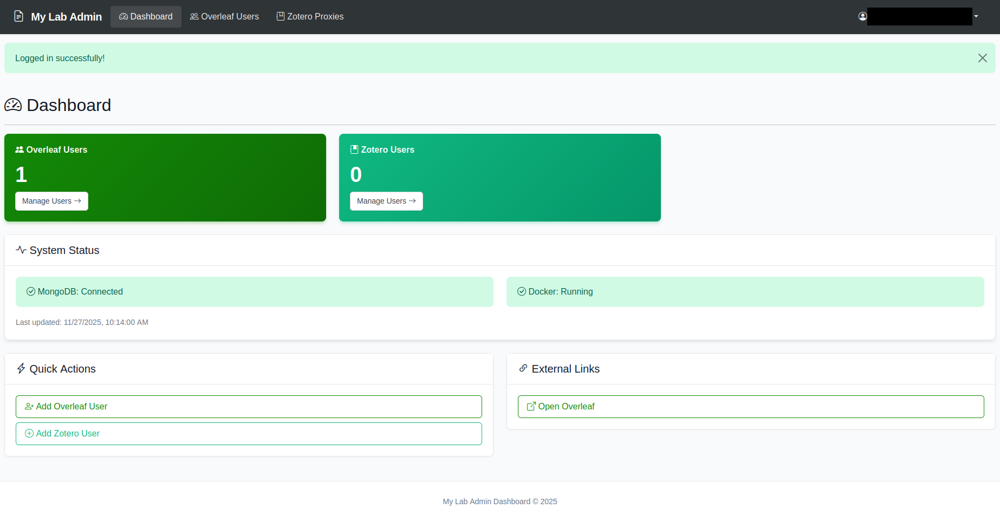
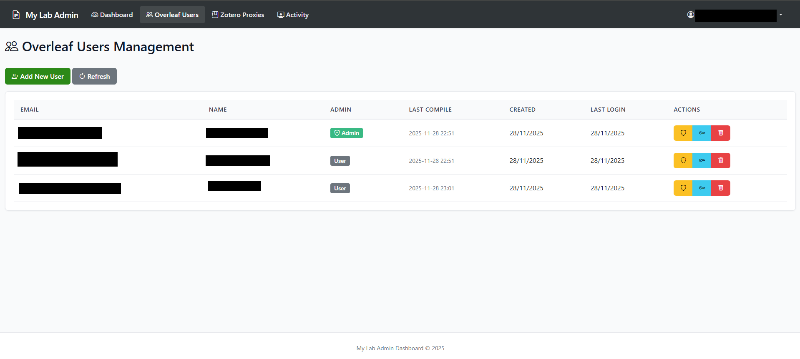
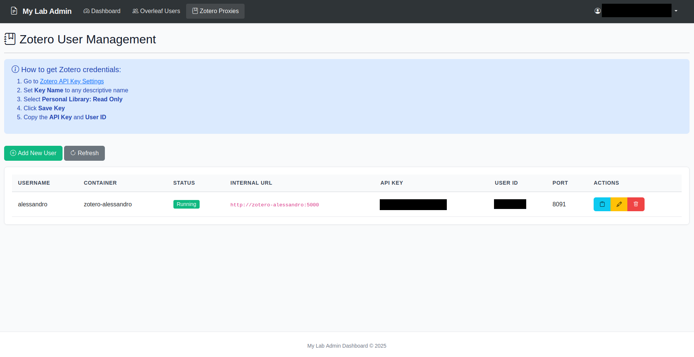
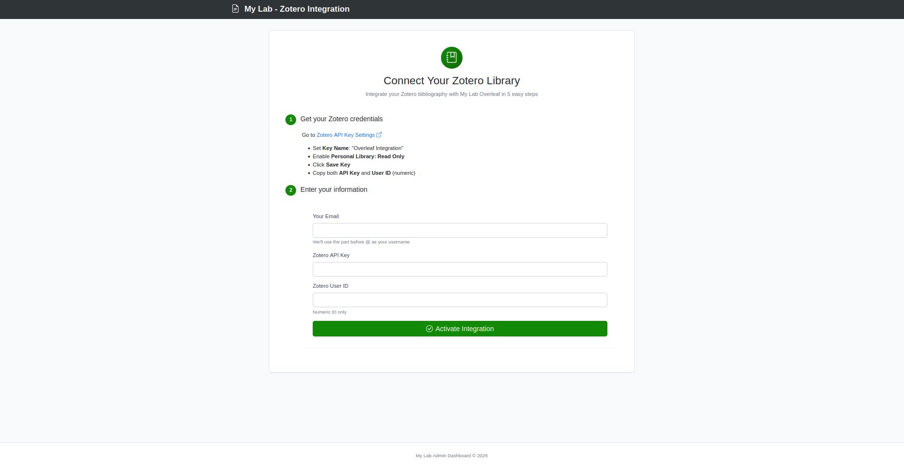
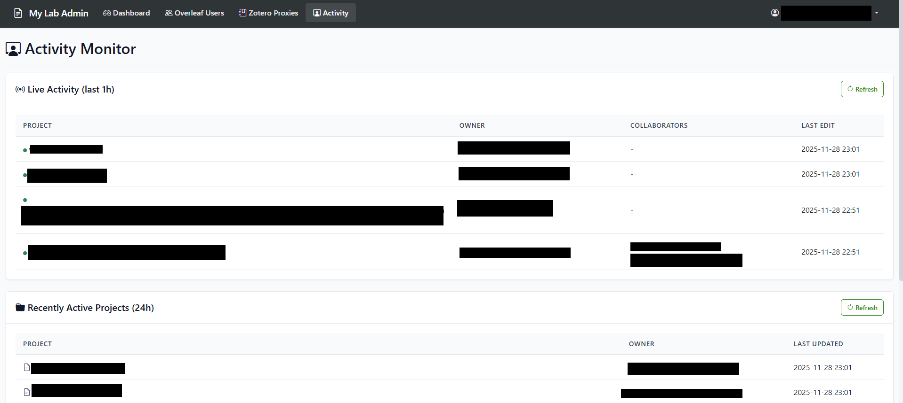

# Overleaf Lab

Zero-stress, single-command setup for a full-featured self-hosted Overleaf with Zotero integration and a web dashboard for user management. Run `./install.sh` and answer a few questions, you'll have a complete LaTeX environment ready for your research lab or team. Public access via Cloudflare Tunnel is also guided.

Scripts have been tested on Ubuntu 24.

## Features

**Overleaf Extended CE** (via [overleaf-cep](https://github.com/yu-i-i/overleaf-cep)):

- Sandboxed Compiles (each project compiles in an isolated container)
- Track Changes
- Comments and review system
- Template gallery
- Project history with restore functionality
- Import Microsoft Word and Markdown documents; export projects as Word, Markdown, or HTML (Pandoc, experimental upstream feature)
- Optional GitHub two-way synchronization (requires a GitHub OAuth App)
- Optional AI Assistant (LLM): in-editor chat + Ask-AI-on-selection + inline completion, backed by a local llama.cpp or any OpenAI-compatible API, with optional per-user OpenAI/Anthropic keys (encrypted at rest)

**Full TeXLive + Microsoft Fonts**:

- Complete TeXLive distribution (all packages included)
- Microsoft core fonts (Arial, Times New Roman, Courier, etc.)
- No "missing package" or "font not found" errors

**Custom Zotero Integration**:

- Access full library or specific collections by name
- `.bib` files importable directly into Overleaf projects (refresh to sync)

**Admin Dashboard**:

- Manage Overleaf users (create, delete, reset passwords, assign/remove admin rights)
- Super Admin role for granular Overleaf admin access control
- Configure Zotero integrations per user (personal and group libraries)
- Optional signup page for Zotero self-registration

## Screenshots

<p align="center">
  
  
</p>

<p align="center">
  
  
</p>

<p align="center">
  
</p>

## Architecture

| Service       | Port | Description                      |
| ------------- | ---- | -------------------------------- |
| **Overleaf**  | 80   | LaTeX editor                     |
| **Dashboard** | 5000 | Admin panel for users and Zotero |

See [CONFIGURATION.md](CONFIGURATION.md) for all settings and customization options.

## SMTP (Recommended)

Email is required for password resets and notifications. For Gmail:

1. Enable 2FA on your Google account
2. Create an App Password: https://myaccount.google.com/apppasswords
3. Use during installation:
   - SMTP Host: `smtp.gmail.com`
   - SMTP Port: `587`
   - SMTP User: `your-email@gmail.com`
   - SMTP Password: `your-app-password`

## Installation

```bash
git clone https://github.com/alelotti96/overleaf-lab.git
cd overleaf-lab
./install.sh
```

The script asks for:

- Lab name and admin email
- Dashboard admin password
- SMTP settings (optional)
- Public Zotero signup (yes/no)
- OIDC single sign-on (optional)
- GitHub synchronization (optional, needs a GitHub OAuth App client ID/secret)
- AI assistant / local LLM (optional)

## After Installation

1. **Create Overleaf admin**: http://localhost/launchpad
2. **Access Dashboard**: http://localhost:5000 (use admin email + password set during install)

### Dashboard Functions

- **Users**: View, create, delete Overleaf users, reset passwords, assign/remove admin rights
- **Zotero**: Add/remove Zotero users, configure API keys per user (supports both personal and group libraries)
- **Activity**: Live project activity tracking with owner and collaborators
- **Signup** (if enabled): Page where users can self-register their Zotero credentials

### Admin Roles

Overleaf Lab distinguishes between two admin levels:

| Role | Overleaf Access | Dashboard |
|------|----------------|-----------|
| **Admin** (`isAdmin: true`) | Manage Users (`/admin/user`) | Full access |
| **Super Admin** (`isAdmin: true` + `adminRoles: ["super_admin"]`) | Manage Users + Manage Site (`/admin`) + Manage Projects (`/admin/project`) + can open any project by URL | Full access |

Only Super Admins can access other users' projects (by URL or from Manage Projects). Normal admins are treated like regular users on projects they are not members of - the upstream behavior (any `isAdmin` user gets owner access to every project, via `ADMIN_PRIVILEGE_AVAILABLE=true` baked into the CEP image) is patched out at container startup.

The user set as `ADMIN_EMAIL` during installation is automatically promoted to Super Admin at each container startup. Additional Super Admins can be assigned from the dashboard via the lock-shield button next to admin users.

## Zotero Integration

Each user gets a personal container serving their Zotero bibliography:

```
http://zotero-username:5000             → Full library
http://zotero-username:5000/collection  → Specific collection
```

In Overleaf: **New File → From External URL** → paste the URL as `references.bib`

> **Technical Note:** The installation automatically configures Overleaf to whitelist internal `zotero-*` container URLs, bypassing SSRF (Server-Side Request Forgery) protection for these trusted internal services.

## AI Assistant (LLM)

An optional in-editor AI assistant: a chat panel, "Ask AI" on a text selection, "Ask AI about this error" on compile-log entries, and inline completion. It is backed by any OpenAI-compatible LLM: a local llama.cpp server, a hosted API, or each user's own key.

It is **opt-in** and ships **off** by default. Enabling it requires **building a custom Docker image** (`overleaf-lab/sharelatex-llm`, layered `FROM` the stock Overleaf image), because the editor frontend is bundled at build time and cannot be added to a running container:

```bash
./scripts/build-llm-image.sh   # ~15-30 min, needs Docker + >=8 GB RAM + network
```

### Enabling

Via the install wizard: answer "yes" to the AI assistant question and fill in the endpoint / key / model. Then build the image and start the stack.

Or manually, on an existing install, set these in `config.env.local`:

```bash
ENABLE_LLM_MODULE="true"
LLM_API_URL="http://172.17.0.1:8080/v1"   # OpenAI-compatible, include /v1
LLM_API_KEY=""                            # empty for a local no-auth server
LLM_MODEL_NAME=""                         # comma-separated; empty = scan from the admin page
LLM_ALLOW_USER_SETTINGS="true"            # let users bring their own keys
```

then build the image and apply:

```bash
./scripts/build-llm-image.sh
./scripts/configure.sh
./scripts/stop.sh && ./scripts/start.sh
```

`configure.sh` swaps `OVERLEAF_IMAGE` to the custom image and auto-generates `LLM_KEY_SECRET` (the key that encrypts per-user API keys at rest); do not set that secret by hand.

### Bring-your-own keys

With `LLM_ALLOW_USER_SETTINGS=true`, each user can add their own provider in their **AI Settings**: an OpenAI endpoint (`https://api.openai.com/v1`) or an Anthropic endpoint (`https://api.anthropic.com/v1`), plus their key and model. A "Personal" model then appears in the chat picker and routes to their account. User keys are **AES-256-GCM encrypted at rest** in MongoDB. The admin LLM settings page (`/admin/llm/settings`) is **super-admin only**.

### Updating

With the LLM module on, `./scripts/update-overleaf.sh` offers to rebuild the custom image on the new base (the image is `FROM overleafcep/sharelatex:<new version>`) before the new image is started. The rebuild re-validates the core patches against the new source and fails loudly if upstream drifted; if that happens, update `overleaf-llm-image/patches/apply-core-patches.mjs` and rebuild before deploying.

### Local LLM with llama.cpp

The cheapest backend is a local [llama.cpp](https://github.com/ggml-org/llama.cpp) server on the same host.

1. Build llama.cpp (see its README).
2. Run `llama-server`, for example:

   ```bash
   llama-server -hf ggml-org/gpt-oss-120b-GGUF -c 8192 --jinja --host 0.0.0.0 --port 8080
   ```

   - `--jinja` applies the model's chat template (required for chat).
   - `-ngl 99 -fa 1` offloads all layers to a GPU with flash attention.
   - `numactl --interleave=all llama-server ...` spreads memory across sockets on a multi-socket CPU box.
   - Model examples: **Qwen3-Coder-30B-A3B** (fast, good for LaTeX / markup) or **gpt-oss-120b** (max quality, needs ~59 GB RAM).

3. Point Overleaf at it in `config.env.local`:

   ```bash
   LLM_API_URL="http://172.17.0.1:8080/v1"
   ```

   `172.17.0.1` is the Docker bridge host IP, so the Overleaf container can reach a `llama-server` running on the host.

**Keep it always running.** Run llama-server as a systemd service so it starts on boot and restarts on crash. Save this to `/etc/systemd/system/llama-server.service` (edit `<user>`, the model, and the flags):

```
[Unit]
Description=llama.cpp server (Overleaf LLM backend)
After=network-online.target
Wants=network-online.target

[Service]
Type=simple
User=<user>
WorkingDirectory=/home/<user>/llama.cpp/build/bin
ExecStart=/usr/bin/numactl --interleave=all /home/<user>/llama.cpp/build/bin/llama-server -hf ggml-org/gpt-oss-120b-GGUF -c 8192 -t 24 --jinja --host 0.0.0.0 --port 8080
Restart=always
RestartSec=5

[Install]
WantedBy=multi-user.target
```

then:

```bash
sudo systemctl daemon-reload && sudo systemctl enable --now llama-server
```

This starts llama-server on boot and restarts it if it crashes.

## Git Integration (Git Bridge)

Overleaf's **Git Bridge** lets you clone, pull, and push an Overleaf project over git using a personal access token, so you can edit locally and sync changes.

**How it is provided here.** Git Bridge is not a dedicated component of this repo: it comes from the underlying [Overleaf Toolkit](https://github.com/overleaf/toolkit). `scripts/configure.sh` writes `GIT_BRIDGE_ENABLED=true` into `overleaf-toolkit/config/overleaf.rc`, which makes the toolkit start the extra `git-bridge` container (from its `lib/docker-compose.git-bridge.yml`). The git-bridge image tag follows `overleaf-toolkit/config/version`, which `./scripts/update-overleaf.sh` keeps aligned with the Overleaf base version. So Git Bridge is **enabled by default** on a standard overleaf-lab install; there are no extra overleaf-lab config variables for it.

**Using it:**

1. In Overleaf, open **Account Settings** and create a **Git access token**.
2. In a project, the git remote lives at `<OVERLEAF_URL>/git/<project-id>` (the project id is the last path segment of the project URL).
3. Clone with the token as the password:

   ```bash
   git clone http://localhost/git/<project-id>
   # username: git    password: <your token>
   ```

   Replace `http://localhost` with your `OVERLEAF_URL`, then `git pull` / `git push` as usual.

For the authoritative, version-specific steps see the toolkit docs: [Git Bridge (CE)](https://github.com/overleaf/toolkit/blob/master/doc/ce-git-bridge.md).

**Troubleshooting.** If token authentication fails after a base-version update, check that `GIT_BRIDGE_OAUTH2_SERVER` in `overleaf-toolkit/lib/docker-compose.git-bridge.yml` points at the internal API (`http://sharelatex:3000`), then restart the stack.

## Public Access

To expose your instance to the internet, use Cloudflare Tunnel (free, no port forwarding needed):

```bash
./scripts/setup-cloudflare-tunnel.sh
```

Requires a Cloudflare account and domain.

### Securing with Cloudflare Access (optional, for increased security)

After setting up the tunnel, configure access policies in the Cloudflare Zero Trust dashboard:

1. Go to [Cloudflare Zero Trust](https://one.dash.cloudflare.com) → **Access** → **Applications**
2. Add a **Self-hosted application** for each service and configure policies:
   - **Overleaf** (overleaf.your-domain.com): restrict to lab members (email list) or group/institution (email domain)
   - **Dashboard** (overleaf-dashboard.your-domain.com): restrict to admins only (email list)
   - **Signup** (zotero-signup.your-domain.com): restrict to lab members (email list) or group/institution (email domain)

Note: Dashboard and Signup point to the same backend but may use different Access policies. The Signup subdomain auto-redirects visitors to the registration page.

## Managing Services

Start/stop Overleaf services:

```bash
./scripts/start.sh   # Start Overleaf, MongoDB, Redis
./scripts/stop.sh    # Stop all services
```

These scripts use the local TexLive image with fonts. Don't use `bin/up` directly.

## Updating Overleaf

To update only the Overleaf image (without touching MongoDB, Redis, or your data):

```bash
./scripts/update-overleaf.sh
```

The script will:
- Show current version
- List available versions from Docker Hub
- Update and restart only the Overleaf container
- Apply migration steps automatically when jumping to a new base version
  (e.g. 6.1.x → 6.2.x: required `OVERLEAF_INVITE_TOKEN_SECRET`, Pandoc
  Word/Markdown import-export, native history restore, upload-limit
  conversion to MB, toolkit version alignment for git-bridge)

Your projects, users, and settings are preserved. MongoDB and Redis remain untouched.

> **Note (6.2.x):** upstream made the redesigned editor mandatory - after
> updating, all users get the new editor UI.

## License

MIT

**Original code in this project:**

- Installation and configuration scripts
- Dashboard (overleaf-zotero-manager) for user and Zotero management
- Zotero proxy containers orchestration

## Credits

This project builds on:

- [Overleaf Community Edition](https://github.com/overleaf/overleaf) - The open-source LaTeX editor (AGPL-3.0)
- [Overleaf-CEP](https://github.com/yu-i-i/overleaf-cep) - Extended CE with premium features (AGPL-3.0)
- [Zotero-Overleaf-BibTeX-Proxy](https://github.com/UPB-SysSec/Zotero-Overleaf-BibTeX-Proxy) - Inspiration for the Zotero integration
